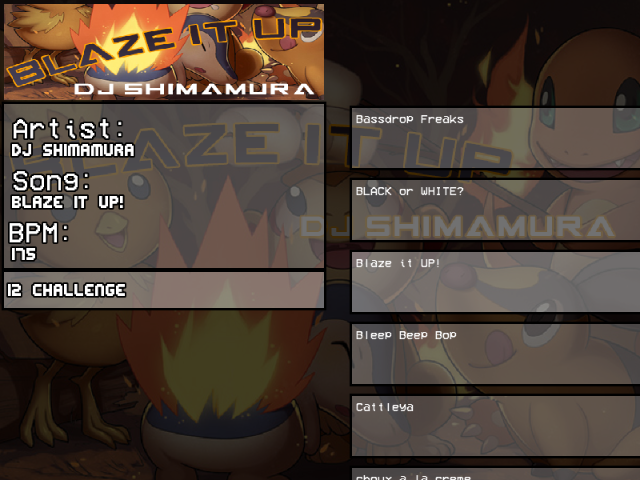

# SFMania

##### What
SFMania is an in-development stepmania client written in C++ with [SFML 2.0](https://www.sfml-dev.org/)

##### Why
I'm working on this project both for fun and for a way to learn more about and practise C++. This client is not yet finised and doesn't currently have all features of the standard client, however I hope to get there soon.

  
   

