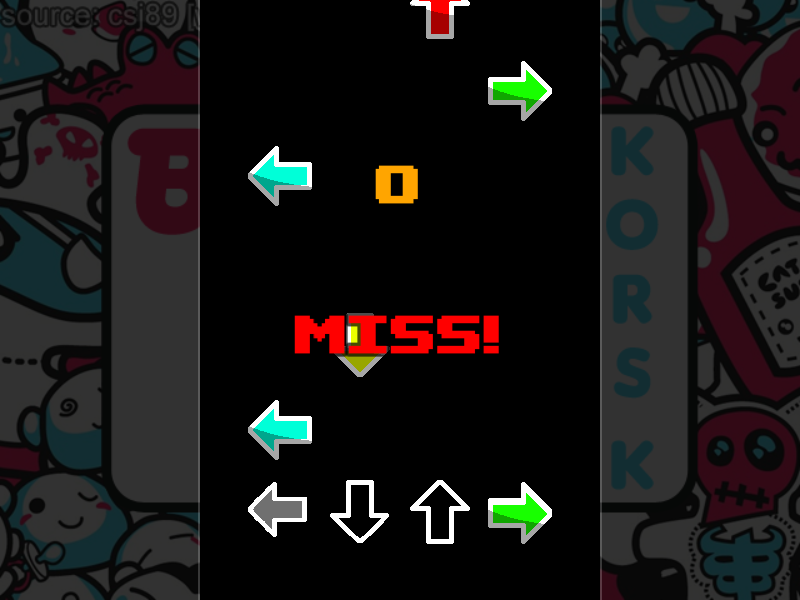

# SFMania

### What
SFMania is an in-development stepmania clone written in C++ with [SFML 2.0](https://www.sfml-dev.org/)

### Why
I'm working on this project both for fun and for a way to learn more about and practise C++. This clone is not yet finished and doesn't currently have all features of the standard game, however this is something I am working towards.

  
   

